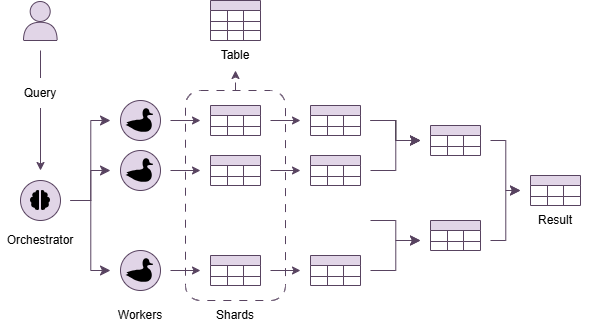

# MiniSnowflake

MiniSnowflake is a lightweight analytical SQL engine that stores tables as sharded datasets and executes queries through a **coordinator + worker** architecture. Workers process data with duckdb instances.

## Motivation

The project exists to provide:
- Parallel processing over large CSV/Parquet sources without a single-node bottleneck
- Iterative map/reduce aggregation similar to distributed analytical warehouses
- A simple environment for experimentation and benchmarking

## How It Works

1. A client submits a SQL query to the orchestrator.
2. The orchestrator:
   - Parses the statement
   - Builds a logical processing plan
   - Dispatches subqueries to available workers
3. Each worker executes its assigned shard:
   - **Map:** Scan shard in parallel and apply filters
   - **Reduce:** Group and aggregate results across n chunks iteratively until a final result is produced

</br>



</br>

# How to Use

Some simple commands to start using the repo

```bash
docker compose up --build --scale worker=4
```

```bash
curl -s http://localhost:8000/query -H "Content-Type: application/json" -d '{
    "path": "src/mini_snowflake/data/test-db",
    "query": "CREATE TABLE t1 (id INT, name VARCHAR, age INT, department VARCHAR, salary INT) if not exists"
  }' | jq
```

```bash
curl -s http://localhost:8000/query   -H "Content-Type: application/json" -d '{
    "path": "src/mini_snowflake/data/test-db",
    "query": "DROP TABLE t1 if exists"                                                                      
  }' | jq
```

```bash
curl -s http://localhost:8000/query -H "Content-Type: application/json" -d '{
    "path": "src/mini_snowflake/data/test-db",
    "query": "INSERT INTO t1 FROM src/mini_snowflake/data/sample_data.csv"                       
  }' | jq
```

```bash
curl -s http://localhost:8000/query -H "Content-Type: application/json" -d '{
    "path": "src/mini_snowflake/data/test-db",
    "query": "SELECT department, MIN(salary) AS min_salary, MAX(salary) AS max_salary, AVG(salary) AS avg_salary, COUNT(*) AS n_employees FROM t1 WHERE department IS NOT NULL AND age >= 21 AND salary > 1000 GROUP BY department;"                       
  }' | jq
```

## SQL Dialect

MiniSnowflake handles a simplified SQL dialect with some custom instructions

### Types
- `TINYINT`
- `SMALLINT`
- `INT / INTEGER`
- `BIGINT / HUGEINT`
- `BIGNUM`
- `UTINYINT`
- `USMALLINT`
- `UINTEGER`
- `UBIGINT / UHUGEINT`
- `FLOAT / REAL`
- `DOUBLE`
- `DECIMAL / NUMERIC`
- `BOOLEAN / BOOL`
- `VARCHAR / TEXT / STRING / CHAR`
- `UUID`
- `BIT`
- `BLOB / BYTEA / VARBINARY`
- `DATE`
- `TIME`
- `TIMESTAMP / TIMESTAMPTZ`
- `INTERVAL`

### Predicates`
- `=`
- `!=`
- `<`
- `<=`
- `>`
- `>=`
- `IS NULL`
- `IS NOT NULL`

### Aggregate Functions
- `COUNT`
- `SUM`
- `MIN`
- `MAX`
- `AVG`

### Constraints
- `CREATE` column option: `IS NOT NULL`
- `WHERE` terms chained with `AND`
- `GROUP BY` columns + aggregates only
- No `JOIN` / `UPDATE` / `DELETE` / `ORDER BY`

- Data import only through custom `INSERT INTO … FROM <path>`

## Grammar

### CREATE
```sql
CREATE TABLE <table> (
  <col> <type> [IS NOT NULL],
  ...
)
[IF NOT EXISTS]
```

### DROP
```sql
DROP TABLE <table>
[IF EXISTS]
```

### INSERT INTO
```sql
INSERT INTO <table>
FROM <src_path>
[ROWS PER SHARD <n>]
```

`<src_path>` indicates a source .parquet or .csv path to import the data from

`ROWS PER SHARD` indicate the number of rows per shard on the new table

### SELECT
```sql
SELECT <select_list>
FROM <table>
[WHERE <predicate> AND <predicate> ...]
[GROUP BY <col> [, <col> ...]]
```

# Components

```
.
├── Dockerfile
├── docker-compose.yml
├── pyproject.toml
├── mypy.ini
├── uv.lock
└── src
    └── mini_snowflake
        ├── parser   # Logic to parse SQL queries
        │   ├── parser.py
        │   └── models.py
        ├── orchestrator
        │   ├── orchestrator.py   # Orchestrator logic (parsing, planning, scheduling)
        │   ├── api.py
        │   ├── client.py
        │   ├── worker_registry.py   # Worker tracking
        │   └── query_maker.py   # Intermediate query generation
        ├── worker
        │   ├── worker.py   # Worker logic (query execution)
        │   ├── api.py
        │   ├── client.py
        │   └── config.py
        ├── common
        │   ├── catalog.py   # DB Catalog of tables
        │   ├── manifest.py   # Table Manifest
        │   ├── io_parquet.py   # Utils for parquet interfacing
        │   ├── db_conn.py   # Connection to DB
        │   └── utils.py
        ├── data
        │   └── sample_data.csv   # Sample data for testing
        └── benchmark   # Synthetic data generator
            ├── data_gen.py
            └── data_gen.yml
```